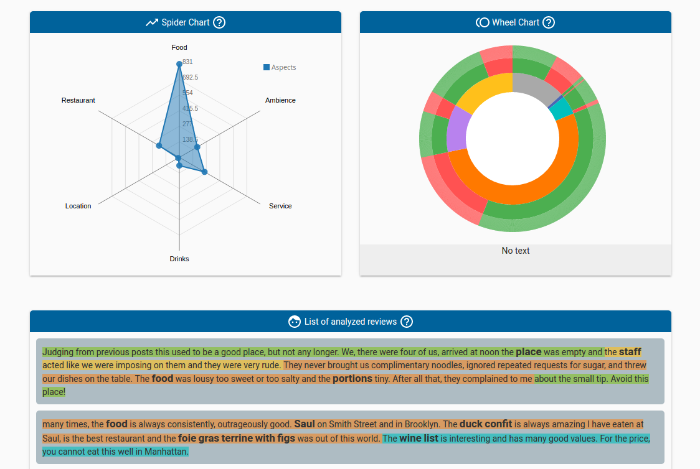

Dashboards
==========

Available dashboards
--------------------

SPARQL DBpedia [#f1]_
~~~~~~~~~~~~~~~~~~~~~

DBpedia is a crowd-sourced community effort to extract structured information from Wikipedia and make this information available on the Web. DBpedia allows you to ask sophisticated queries against Wikipedia, and to link the different data sets on the Web to Wikipedia data.

This dashboard provides a graphic interface to ask SPARQL queries against DBpedia.

.. image:: images/dbpedia.png
  :height: 400px
  :scale: 100 %
  :align: center

Tourpedia [#f1]_
~~~~~~~~~~~~~~~~

TourPedia is the result of an European project. It is a demo of OpenNER (Open Polarity Enhanced Name Entity Recognition). It contains information about accommodations, restaurants, points of interest and attractions of different places in Europe.

TourPedia provides two main datasets: Places and Reviews. Each place contains useful information such as the name, the address and its URI to Facebook, Foursquare, GooglePlaces and Booking. Reviews contain also some useful details ready for us to exploit.

This dashboard also allows you to ask SPARQL quereies against our TourPedia database.

.. image:: images/tourpedia.png
  :height: 400px
  :scale: 100 %
  :align: center

Financial Twitter Tracker [#f1]_
~~~~~~~~~~~~~~~~~~~~~~~~~~~~~~~~

Financial Twitter Tracker is an R&D project of GSI Group that contains information about people talking about brands in social media like Twitter, Facebook, and more...

This dashboard provides interactive Web Components to visualize people's opinion polarities and also has a SPARQL editor to ask queries about these opinions using RDF specifications.

.. image:: images/ftt.png
  :height: 400px
  :scale: 100 %
  :align: center

Footballmood [#f2]_
~~~~~~~~~~~~~~~~~~~

Footballmood is an application developed for sentiment analysis of football in Twitter. This dashboard provides interactive Web Components to visualize people's opinion polarities and also has a SPARQL editor to ask queries about football players against DBpedia.

Aspects [#f3]_
~~~~~~~~~~~~~~

Aspects dashboard is an analyser developed for aspects sentiment analysis of restaurant reviews. This is the result of analysis showed on a dashboard based on web components and D3.js. To view your data you can use widgets and visualize it through them.

The data used for the dashboard is the Semeval 2015 ABSA dataset (Task 12) for restaurant domain, available `here <http://alt.qcri.org/semeval2015/task12/>`_

GSI Crawler [#f4]_
~~~~~~~~~~~~~~~~~~

This dashboard is useful to the analysis of comments from external aplications like Amazon and Foursquare. The user will choose the type of analysis he wants to carry out (Emotions, Sentiments or Fake Analysis) and he will also supply, for instance, a direct URL to a Amazon’s Product. 

GSI Crawler will download the comments belonging to this element and, later, the pertinent analysis will be run using the Senpy tool [#f5]_. Once the analysis is finished, a summary of the result will be shown and the possibility of review each comment one by one will be also offered.

Developing your own dashboard
-----------------------------

In this section we will explain how to create new dashboards in Sefarad, or import existing ones. First of all you must create a new directory inside **elements** (e.g ``elements/my-dashboard``), and move inside all your dashboard files (e.g my-dashboard.html).

In addition, you have to define your dashboard structure as follows in **my-dashboard.html** file.

.. sourcecode:: html

	<dom-module id="my-dashboard">

 	<template>
	  	<!--   dashboard content   -->
 	</template>

	</dom-module>

Inside ``<dom-module>`` tag you have to define your new Polymer dashboard adding some JavaScript:

.. sourcecode:: javascript
	

	Polymer({
		is: 'my-dashboard',
		properties: {
			// dashboard properties
		},
		ready: function(){
			do_some_function();    	
		}
	});

Is also necessary to specify dependencies for this dashboard using a bower.json file. The structure of this file is like this example:

.. sourcecode:: json

	{
	  "name": "my-dashboard",
	  "homepage": "https://lab.cluster.gsi.dit.upm.es/sefarad/your-dashboard-url",
	  "authors": [
	    "GSI-UPM"
	  ],
	  "description": "",
	  "main": "",
	  "license": "MIT",
	  "dependencies": {
	    "paper-card": "PolymerElements/paper-card#^1.1.4",
	    "polymer": "polymer#*",
	    "google-chart-elasticsearch": "google-chart-elasticsearch#*"
	}

If you want to make your dashboard installable via bower you can register this package. This requires to have a git repository with all your dashboard code.

.. sourcecode:: bash

	$ bower register <my-package-name> <git-endpoint>

Afterwards, you have to create a new file in ``dashboards`` folder. In this example, is called **newdashboard.html**. This file must have the same structure as other files in this folder, but you need to change the following lines to display your new dashboard.

.. sourcecode:: html

	...
	<iron-pages attr-for-selected="data-route" selected="my_dashboard_route">
		<section data-route="my_dashboard_route">
			<my-dashboard></my-dashboard>
		</section>
	</iron-pages>
	...

Finally, complete the ``app.wsgi`` and ``elements.html`` files located inside elements directory.

**app.wsgi**

.. sourcecode:: python

	...
	@route('/mydashboard')
	def mydashboard():
		return static_file('/dashboards/newdashboard.html', root='')
	...

**elements.html**

.. sourcecode:: html

	<link rel="import" href="../bower_components/my_component/my_component.html">
	<link rel="import" href="my-dashboard/index.html">

Remember to add your Polymer Web Components to ``bower_components`` directory if not included yet. Edit css if necessary.

After following these steps, build up Sefarad environment and you should visualize your dashboard successfully.

.. rubric:: References

.. [#f1] Enrique Conde Sánchez. (2016). Development of a Social Media Monitoring System based on Elasticsearch and Web Components Technologies.
.. [#f2] Alberto Pascual Saavedra. (2016). Development of a Dashboard for Sentiment Analysis of Football in Twitter based on Web Components and D3.js.
.. [#f3] Manuel García-Amado. (2016). Development of an Aspect-based Sentiment Analyzer for the Social Web and Application to Product Reviews.
.. [#f4] José Emilio Carmona. (2016). Development of a Social Media Crawler for Sentiment Analysis.
.. [#f5] J. Fernando Sánchez-Rada, Carlos A. Iglesias, Ignacio Corcuera-Platas & Oscar Araque (2016). Senpy: A Pragmatic Linked Sentiment Analysis Framework. In Proceedings DSAA 2016 Special Track on Emotion and Sentiment in Intelligent Systems and Big Social Data Analysis (SentISData).