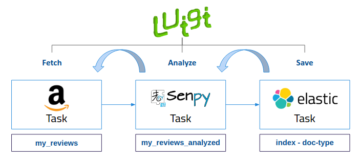

Luigi Pipelines
---------------

We use Luigi as orchestrator to build pipelines through our search and indexing system and the analytic services, in order to facilitate analysis. It handles dependency resolution, workflow management, visualization etc. Luigi needs a script describing the pipeline to follow.

These scripts describe tasks. This tasks has a execution sequence, i.e. the final task depend on the others. This means that for running the script you only need to call the final task.

For following steps, the example used is sefarad.py (this script is located inside Luigi folder) 

In our example tasks are: FetchDataTask, SenpyTask and Elasticsearch.

* **FetchDataTask**: The main goal of this task is to read the JSON file.

.. code:: python

	 def run(self):
        """
        Writes data in JSON format into the task's output target.
        The data objects have the following attributes:
        * `_id` is the default Elasticsearch id field,
        * `text`: the text,
        """
        #today = datetime.date.today()
        file = self.filename

        with open(file) as f:
            j = json.load(f)
            for i in j:
                i["_id"] = i["id"] #necessary for elasticsearch index
        with self.output().open('w') as output:
            json.dump(j, output)
            output.write('\n')

* **SenpyTask**: This task loads data fetched with previous task and send it to Senpy tool in order to analyse data retrieved and check sentiments expressed.

.. code:: python

	 def run(self):
        """
        Send data to Senpy tool and retrieve it analyzed. Store data in a json file.
        """
        with self.output().open('w') as output:
            with self.input().open('r') as infile:
                j = json.load(infile)
                for i in j:
                    r = requests.get('http://test.senpy.cluster.gsi.dit.upm.es/api/?algo=sentiment-tass&i=%s' % i["text"])
                    response = r.content.decode('utf-8')
                    response_json = json.loads(response)
                    i["_id"] = i["id"]
                    #i["analysis"] = response_json
                    i["sentiment"] = response_json["entries"][0]["sentiments"][0]["marl:hasPolarity"]	
                    i["polarity"] = response_json["entries"][0]["sentiments"][0]["marl:polarityValue"]   
                    output.write(json.dumps(i))
                    #print(i)
                    output.write('\n')

* **Elasticsearch**: This task loads JSON data contained in the file produced in the previous step into an Elasticsearch index.

Running Luigi pipelines
~~~~~~~~~~~~~~~~~~~~~~~

This command is for running your pipelines. You have to introduce your script name in modules and the end task of your script.

.. sourcecode:: bash

	$ sudo docker-compose exec luigi python -m luigi --module <your-script-name> <your-final-task> --index <your-elasticsearch-index> --doc-type <your-elasticsearch-doctype> -- filename <your .json path>

In our example:

.. sourcecode:: bash

	$ sudo docker-compose exec luigi python -m luigi --module add_tweets Elasticsearch --index tourpedia --doc-type places --filename add_demo.json

Create your own pipelines like in the example and add them to Luigi folder is also necessary to add your JSON file to this folder, run them with the same command explained above. 

Cron Luigi Pipeline
~~~~~~~~~~~~~~~~~~~

This cron job is designed for sentiment analysis in Twitter every day. This will update your dashboard content automatically.
For using this cron pipeline is necessary to change docker-compose.yml file adding your own enviroment variables:

There are the following parameters available:

.. note::

    If you set LUIGI_AUTO_ENABLED to False the other parameters are not needed.

.. code:: yaml

    - LUIGI_AUTO_ENABLED=True #Set this to True if you want to start Twitter analysis pipeline as a cron job
    - CONSUMER_KEY={your twitter CONSUMER_KEY goes here}
    - CONSUMER_SECRET={your twitter CONSUMER_SECRET goes here}
    - ACCESS_TOKEN={your twitter ACCESS_TOKEN goes here}
    - ACCESS_TOKEN_SECRET={your twitter ACCESS_TOKEN_SECRET goes here}
    - EMAIL={email addres for Luigi notifications}
    - SMTP_HOST={your SMTP server}
    - SMTP_PORT={your SMTP server port}
    - SEARCH_QUERY={twitter hashtag or user you want to track}
    - INDEX={elasticsearch index to store your data}
    - DOC_TYPE={elasticsearch data doctype}

Mail configuration is not required but is highly recommended to be notified when a task fails.

.. note::
	
	Please visit, https://apps.twitter.com/ to create your app if you don't have your Twitter credentials.

After your configuration is completed, run Sefarad image again:

.. code:: bash 
		
		$ sudo docker-compose up

.. note::

	If your get a connection error: build the image again and then run it.

Finally, check your elasticsearch index entered above. If you want to use this new data in your dashboard just update your index and doc-type references in your HTML dashboard file.

Luigi Service
~~~~~~~~~~~~~~~~~~~
In order to queue new crawling requests, a Python Flask server has been developed to stack these tasks using Luigi. The service enables to send basic input parameters, such as the url of the website desired to be scrapped, the analysis type and the elasticSearch basic information. The remote service processes all these data and creates performs the pipeline in background, fetching, analyzing and finally saving the data. The service returns the id and index where has been stored in elasticSearch.

To explain more in deepth this work-flow process, we are going to briefly introduce an illustrative example.

The case study explained is: "**Perform a sentiment analysis for HP Wired USB Keyboard from Amazon website**". The pipeline architecture is represented below:

The service receives the new task input parameter, which are the url of the product from where the reviews will be extracted, the analysis that is going to be performed and the platform where is hosted the product. The service creates a new elasticSearch task and the execution begins. Once the result is saved in elasticSearch, the API call returns the destination where its stored so the user can retrieve it. This service is only available for Amazon and Foursquare platforms, and is currently used by the GSICrawler dashboard.