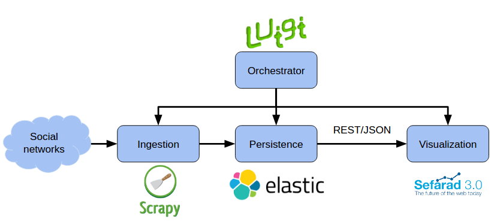

What is Sefarad?
----------------

Sefarad is an environment developed to explore, analyse and visualize data. This environmet has a modular structure.

Architecture
============

Sefarad environment is divided in three main modules, each one is focused in one concrete task:

* Visualisation, the main function of this module is to represent data which were processed and draw different charts to visualize interesting data. This visualisation is structured in several dashboards, which are web pages oriented to display all the collected information . In addition, these dashboards are divided in other components (Polymer Web Components) that globally compound the dashboard itself.
* ElasticSearch [#f1]_, represents the persistence layer of the project and stores all the amount of data needed for the visualisation.
* Luigi, is used as an orchestrator to build sequences of tasks named pipelines through analytic services and elasticSearch, in order to facilitate analysis. Luigi is also used to populate elasticSearch with data. 

In this figure is a detailed view of the architecture described above.

Dashboards
~~~~~~~~~~~~~~~~~~~~~~~
Sefarad framework has multiple predefined dashboards which are ready to be used. Due to its high flexibility, it enables to display any kind of information, either user custom data sets or others included by default in the project. 

In this section we are going to explain each dashboard, detailing most user-attractive functionalities using a predefined dataset and presenting the real value of the tool, so anyone can use Sefarad framework by applying their customized data.

Due to the modular architecture offered by Sefarad framework, each dashboard has its own structure regardless, being able to interact with the components without influecing the rest. Moreover we are going to focus on explain what can be done in every dashboard through a case study without deepening inside its internal behaviour.

Tourpedia
**********************

Overview
^^^^^^^^^^^^^^^^^^^^^
In progress

Case study
^^^^^^^^^^^^^^^^^^^^^
In progress

Conclusions
^^^^^^^^^^^^^^^^^^^^^
In progress

Financial Twitter Tracker
**********************

Overview
^^^^^^^^^^^^^^^^^^^^^
In progress

Case study
^^^^^^^^^^^^^^^^^^^^^
In progress

Conclusions
^^^^^^^^^^^^^^^^^^^^^
In progress

...

.. rubric:: References

.. [#f1] http://elastic.co