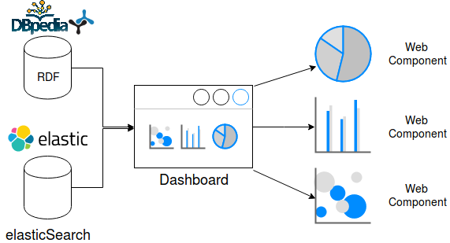

What is Sefarad?
----------------

Sefarad is an environment developed to explore, analyse and visualize data. This environmet has a modular structure.

Architecture
============

Sefarad environment is divided in three docker containers, each one is focused in one task:

* Visualisation, the main function of this module is to represent data which were processed and draw different charts to visualize interesting data. This visualisation is structured in different dashboards. In addition, these dashboards are divided in different Widgets based on Polymer Web Components.
* ElasticSearch [#f1]_, stores all the amount of data needed for the visualisation.
* Luigi, is used as an orchestrator to build pipelines through analytic services and elasticSearch, in order to facilitate analysis. Luigi is also used to populate elasticSearch with data. 

In this figure is a detailed view of the architecture described above.

.. rubric:: References

.. [#f1] http://elastic.co