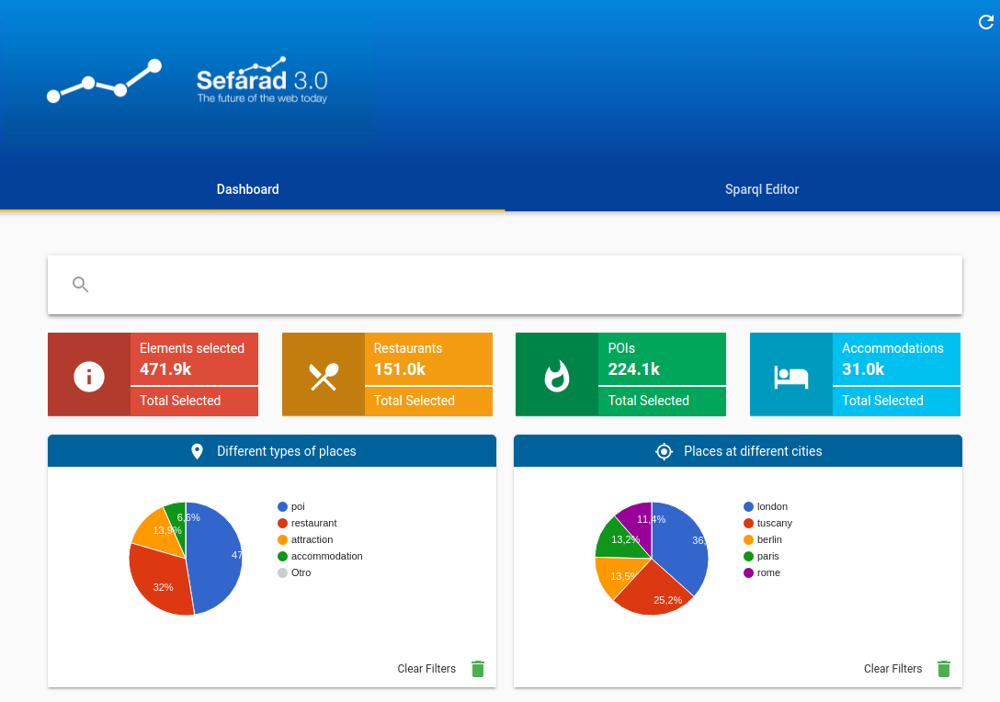

What is Sefarad?
----------------

Sefarad is an environment developed to explore, analyse and visualize data. This environmet has a modular structure.

Architecture
============

Sefarad environment is divided in three main modules, each one is focused in one concrete task:

* Visualisation, the main function of this module is to represent data which were processed and draw different charts to visualize interesting data. This visualisation is structured in several dashboards, which are web pages oriented to display all the collected information . In addition, these dashboards are divided in other components (Polymer Web Components) that globally compound the dashboard itself.
* ElasticSearch [#f0]_, represents the persistence layer of the project and stores all the amount of data needed for the visualisation.
* Luigi, is used as an orchestrator to build sequences of tasks named pipelines through analytic services and elasticSearch, in order to facilitate analysis. Luigi is also used to populate elasticSearch with data. 

In this figure is a detailed view of the architecture described above.

.. image:: images/arch.png
  :height: 320px
  :scale: 100 %
  :align: center

Dashboards
==========

Sefarad framework has multiple predefined dashboards which are ready to be used. Due to its high flexibility, it enables to display any kind of information, either user custom data sets or others included by default in the project. 

In this section we are going to explain each dashboard, detailing most user-attractive functionalities using a predefined dataset and presenting the real value of the tool, so anyone can use Sefarad framework by applying their customized data.

Due to the modular architecture offered by Sefarad framework, each dashboard has its own structure regardless, being able to interact with the components without influecing the rest. Moreover we are going to focus on explain what can be done in every dashboard through a case study without deepening inside its internal behaviour.

SPARQL DBpedia [#f1]_
~~~~~~~~~~~~~~~~~~~~~

DBpedia is a crowd-sourced community effort to extract structured information from Wikipedia and make this information available on the Web. DBpedia allows you to ask sophisticated queries against Wikipedia, and to link the different data sets on the Web to Wikipedia data.

This dashboard provides a graphic interface to ask SPARQL queries against DBpedia.

.. image:: images/dbpedia.png
  :height: 400px
  :scale: 100 %
  :align: center

Tourpedia [#f1]_
~~~~~~~~~~~~~~~~

TourPedia is the result of an European project. It is a demo of OpenNER (Open Polarity Enhanced Name Entity Recognition). It contains information about accommodations, restaurants, points of interest and attractions of different places in Europe.

TourPedia provides two main datasets: Places and Reviews. Each place contains useful information such as the name, the address and its URI to Facebook, Foursquare, GooglePlaces and Booking. Reviews contain also some useful details ready for us to exploit.

This dashboard also allows you to ask SPARQL quereies against our TourPedia database.

Financial Twitter Tracker [#f1]_
~~~~~~~~~~~~~~~~~~~~~~~~~~~~~~~~

Financial Twitter Tracker is an R&D project of GSI Group that contains information about people talking about brands in social media like Twitter, Facebook, and more...

This dashboard provides interactive Web Components to visualize people's opinion polarities and also has a SPARQL editor to ask queries about these opinions using RDF specifications.

.. image:: images/ftt.png
  :height: 400px
  :scale: 100 %
  :align: center

Footballmood [#f2]_
~~~~~~~~~~~~~~~~~~~

Footballmood is an application developed for sentiment analysis of football in Twitter. This dashboard provides interactive Web Components to visualize people's opinion polarities and also has a SPARQL editor to ask queries about football players against DBpedia.

.. image:: images/footballmood.png
  :height: 400px
  :scale: 100 %
  :align: center

Aspects [#f3]_
~~~~~~~~~~~~~~

Aspects dashboard is an analyser developed for aspects sentiment analysis of restaurant reviews. This is the result of analysis showed on a dashboard based on web components and D3.js. To view your data you can use widgets and visualize it through them.

The data used for the dashboard is the Semeval 2015 ABSA dataset (Task 12) for restaurant domain, available `here <http://alt.qcri.org/semeval2015/task12/>`_

.. image:: images/aspects.png
  :height: 400px
  :scale: 100 %
  :align: center

GSI Crawler [#f4]_
~~~~~~~~~~~~~~~~~~

This dashboard is useful to the analysis of comments from external aplications like Amazon and Foursquare. The user will choose the type of analysis he wants to carry out (Emotions, Sentiments or Fake Analysis) and he will also supply, for instance, a direct URL to a Amazon’s Product. 

GSI Crawler functionalities relies on enqueue system. The website generates a query with relevant information, such as the url, the website, the analysis type that is going to be performed etc. This parameters trigger a Luigi pipeline, which is a sequence of tasks that follow a depedency tree each other. These tasks fetch the information from the provided link, preprocess it, run the sentiment or emotion analysis using Senpy tool [#f5]_ and finally store it in elasticSearch so it can be accessed from the client.

The website receives the path where the result has been saved, retrieving the information and making a query to elasticSearch to add a new card within the user interface containing the output data.

.. image:: images/gsicrawler.png
  :height: 400px
  :scale: 100 %
  :align: center

GSICrawler tool is directly connected with a Luigi task service, adding a new task to a remote queue everytime an analysis is requested, and retrieving the result from the elasticSearch index obtained. The queue service is detailed in `Pipelines > Luigi Service <http://sefarad.readthedocs.io/en/latest/pipelines.html#luigi-service>`_ section.

.. rubric:: References

.. [#f0] http://elastic.co
.. [#f1] Enrique Conde Sánchez. (2016). Development of a Social Media Monitoring System based on Elasticsearch and Web Components Technologies.
.. [#f2] Alberto Pascual Saavedra. (2016). Development of a Dashboard for Sentiment Analysis of Football in Twitter based on Web Components and D3.js.
.. [#f3] Manuel García-Amado. (2016). Development of an Aspect-based Sentiment Analyzer for the Social Web and Application to Product Reviews.
.. [#f4] José Emilio Carmona. (2016). Development of a Social Media Crawler for Sentiment Analysis.
.. [#f5] J. Fernando Sánchez-Rada, Carlos A. Iglesias, Ignacio Corcuera-Platas & Oscar Araque (2016). Senpy: A Pragmatic Linked Sentiment Analysis Framework. In Proceedings DSAA 2016 Special Track on Emotion and Sentiment in Intelligent Systems and Big Social Data Analysis (SentISData).

